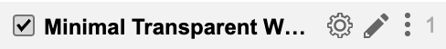

# whatsapp-css
The only fully real transparent theme for Whatsapp.

 

Dark theme for Whatsapp, using UserCSS that overwrites the known look for a modern, transparent and minimalist one.

You can install it with Stylus clicking on the button above, then modify the parameters clicking on the *gear icon* next to the Title.

You can install Stylus on [Chrome](#google-chrome), [Firefox](#mozilla-firefox), [Opera](#opera) or [Edge](#edge) (with an Google Chrome compatibility extension).

Feel free to modify it, just [gives credit](#license) where it belongs ;)

## Features

### Transparency.
`userstyles.org input:` *`Transparency`*

You can set the entire theme's color, or transparency. Just pick a RGBA value, and write down on `--background` variable and you're set!

### Colors.
`userstyles.org input:` *`Background color`*, *`Accent`*, *`Text`*, *`Link`*, *`Message Out Bubble`*

You can change colors for:
- Accent (notificacions bubbles, menu hover items, scrollbars)
- Background (in case you want just a color and not an image)
- Text
- Links (different from Text color)
- Message Out Bubble (Whatsapp makes just that difference in it's original style)

### Font Family.
`userstyles.org input:` *`Font`*

- Modern (Helvetica and other sans-serif)
- Times New Roman (Palatino Lynotype and other serif)
- Console (Lucida Console and other console fonts)
- Old Console (Courier new and other old console fonts)
- Custom Font (instructions here)

#### Custom Font.
`userstyles.org input:` *`Custom Installed Font`*

For your own Custom Font, follow this steps:
- Have the font already installed on your system
- Open your font file and copy the *PostScript Name*
  - Windows
    - Go to `%WINDIR%/Fonts`
    - Right-click the font of your choice
    - In `Details` tab, copy `Title` value
  - MacOS
    - Open `Font Book` app
    - Select the font of your choice
    - Click in the `Info` icon on the top left
    - Copy the `PostScript Name` value
- On the Style page on Userstyles.org, select *Custom* on the *Font* dropdown
- Then paste the *Postscript Name* into *Custom Installed Font*

### Doodles bakground.
`userstyles.org input:` *`Doodles`*

Original Whatsapp doodles pattern background, they're set on top of any background image or color you choose.
In two flavors (black or white), or none.

### Private Mode.
`userstyles.org input:` *`Privacy Mode`*

It blurs everything I consider to be private. You have to mouse-over to see all of this elements:
- Avatars
- Emojis
- Chat list names
- Chat title (contact name)
- Photographs and videos
- Stickers
Plus attenuates font opacity.

### Fullscreen.
`userstyles.org input:` *`Fullscreen`*

Whatsapp shrinks chat div app on resolutions bigger than 1396 pixels wide. If you have more than 1396 pixels wide resolution, you can choose to set the app div to be fullscreen or boxed.

### Background Image.
`userstyles.org input:` *`Background Image`*

You can choose a real background image, that covers all the background.
And if you set Transparency on the *Background Color*, you can see it through the Whatsapp interface!
You can choose *Color* (then set your desired color on *Background Color*), Night Sky, Black or upload your own image.

Be sure to choose contrasted background/interface/fonts variables. I suggest to choose darker interface, and bright text colors. It can be any background you choose.

#### Background Blur.
`userstyles.org input:` *`Background Image Blur (in pixels)`*

You can choose background blur, in pixels ammount. This, helps legibility and gives greater enhancement to text and interface elements.

### Emoji Opacity.
`userstyles.org input:` *`Emoji Opacity`*

For better legibility, you can attenuate emojis on the emoji selector panel. Write a decimal between 0 and 1 to set it (0 full transparent, 1 full opaque).

## Installation
This style works with a User Styles Manager. Actually, the two most downloaded are:

[Stylus](https://github.com/stylus/stylus)

[Stylish](https://github.com/stylish-userstyles/stylish)

Both extensions works, and have differences, the main one, referring to [your privacy](https://robertheaton.com/2018/07/02/stylish-browser-extension-steals-your-internet-history/). Choose wisely.

### Mozilla Firefox
[Latest release](https://www.mozilla.org/firefox)
[Stylus](https://addons.mozilla.org/firefox/addon/styl-us/)
[Stylish](https://addons.mozilla.org/firefox/addon/stylish/)

### Google Chrome
[Latest release](https://www.google.com/chrome/)
[Stylus](https://chrome.google.com/webstore/detail/stylus/clngdbkpkpeebahjckkjfobafhncgmne)
[Stylish](https://chrome.google.com/webstore/detail/stylish-custom-themes-for/fjnbnpbmkenffdnngjfgmeleoegfcffe)

### Opera
[Latest release](https://www.opera.com/download)
[Stylus](https://addons.opera.com/extensions/details/stylus/)

### Edge
It seems you can install Chrome extensions through the [Edge Extension Kit](https://www.microsoft.com/p/microsoft-edge-extension-toolkit/9nblggh4txvb?rtc=1&activetab=pivot:overviewtab#), then download the Chrome extension and load into it. Reports says it works well.

## Bux fixing
You can follow standard bug submitting on the [Issues](https://github.com/nufrankz/whatsapp-css/issues) tab, and/or other ways of contributing.

You can always donate to me on PayPal on the button below, I will be more than appretiated :)
<form action="https://www.paypal.com/cgi-bin/webscr" method="post" target="_top">
<input type="hidden" name="cmd" value="_donations" />
<input type="hidden" name="business" value="H55P74TNL4V9E" />
<input type="hidden" name="currency_code" value="USD" />
<input type="image" src="https://www.paypalobjects.com/en_US/i/btn/btn_donate_SM.gif" border="0" name="submit" title="PayPal - The safer, easier way to pay online!" alt="Donate with PayPal button" />

</form>

## Licence

This work is licensed under the [General Public License v3.0](https://www.gnu.org/licenses/gpl-3.0.html), and it will be _very welcome that you include mentions in your source code_ if you extract something from here, _mate_ ;)
